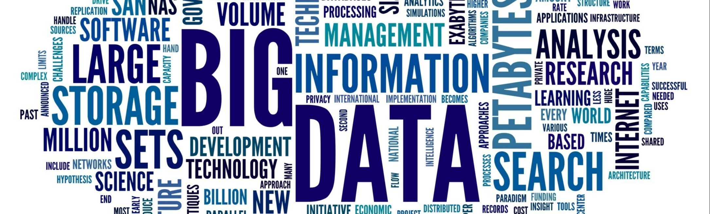

   

  

# Lucas Schulmeister
*Engenheiro de dados*

Como profissional de dados, busco criar e ajudar no desenvolvimento da infraestrutura que dá suporte ao time de dados, possibilitando que as empresas compreendam a sua realidade baseada em fatos, além de auxiliar em uma tomada de decisão mais assertiva. Passei por diversas áreas dentro da tecnologia, inclusive sendo gerente de TI. Mas foi trabalhando com dados que me senti realizado.

**Background:** 
  - Airflow
  - Python
  - AWS 
    - EC2 \ EMR \ S3 \ Kinesis \ Glue \ Athena \ Redshift \ DynamoDB \ Secrets Manager
  - Azure
    - Data Factory \ Blob Storage \ Key Vault \ DevOps \ Event Hubs
  - Databricks
  - PySpark
  - Snowflake
  - Docker
  - Jenkins
  - SQL
  - MongoDB
  - StreamSets
  - CDC
  - Pentaho 
    - PDI \ PRD \ PSW \ BI Server
  - Git
  - API Rest
  - Linux

**Links:**
* [LinkedIn](https://www.linkedin.com/in/lucasschulmeister)
* [Medium](https://lucas-schulmeister.medium.com/)

## Projetos:
Veja os tutoriais publicados:

---
