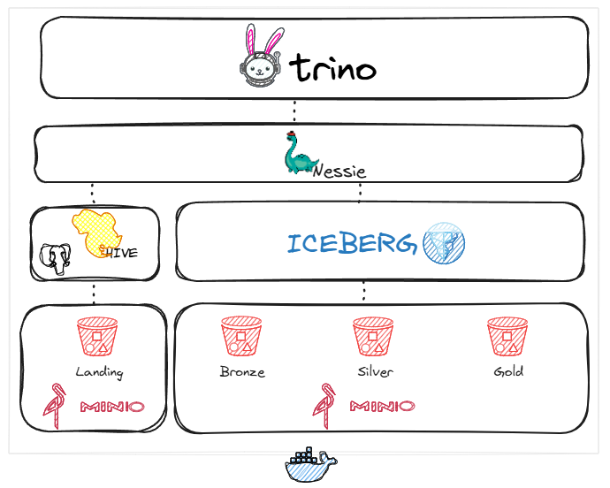

# Local Lakehouse

Stack Trino lakehouse utilizando
- Nessie
- Iceberg
- Hive
- Postgres
- Minio

Subir a stack
~~~cmd
docker-compose up -d
~~~

Após a inicialização do container hive-metastore, descomentar o parâmetro IS_RESUME.
~~~cmd
      - IS_RESUME="true"
~~~

Rodar novamente 
~~~cmd
docker-compose up -d
~~~

## Trino
http://localhost:8880/ui/login.html \
User: admin

catálogos configurados | arquivo |
------------ | ------------ |
metastore | metastore.properties |
s3lakehouse | s3lakehouse.properties |

metastore.properties
~~~cmd
connector.name=hive
hive.metastore.uri=thrift://hive-metastore:9083
hive.s3.path-style-access=true
hive.s3.endpoint=http://storage:9000
hive.s3.aws-access-key=admin
hive.s3.aws-secret-key=password

~~~

s3lakehouse.properties
~~~cmd
connector.name=iceberg
iceberg.catalog.type=nessie
iceberg.nessie-catalog.uri=http://catalog:19120/api/v1
iceberg.nessie-catalog.default-warehouse-dir=s3://lakehouse
fs.native-s3.enabled=true
s3.endpoint=http://storage:9000
s3.region=us-east-1
s3.path-style-access=true
s3.aws-access-key=admin
s3.aws-secret-key=password

~~~

Conectando no Trino
~~~cmd
docker exec -it trino trino
~~~

~~~cmd
trino> show catalogs;
   Catalog   
-------------
 jmx         
 memory      
 metastore   
 s3lakehouse 
 system      
 tpcds       
 tpch        
(7 rows)
~~~

## Nessie
http://localhost:19120/

## Minio
http://localhost:9001/login \
User: admin \
Pwd: password

## Postgres
Host: localhost \
Port: 5431 \
DB: hive_metastore \
User: hive \
Pwd: password
