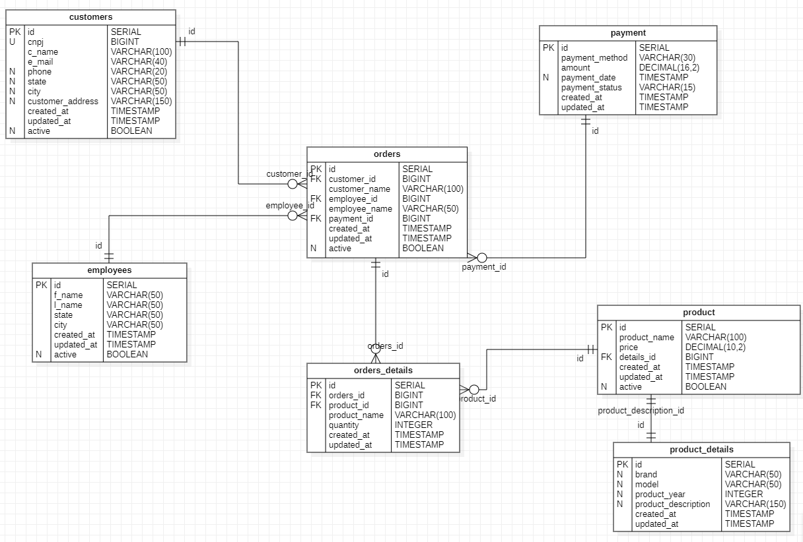

# Fake Data

Projeto que cria base de dados para estudos.
Essa base é movimentada através de procedures, functions e triggers. Ela é criada e atualizada através de um app em python utilizando o pacote faker.
Foi modelado um sistema simples de vendas, composto pelas tabelas:

- employees
- customers
- payment
- product
- product_details
- orders
- orders_details

## Banco de Dados

Como base foi utilizado o PostgreSQL.
Precisamos conectar ao postgres para criar o usuário, a base e a permisão para o projeto. Acesse o servidor de banco de dado.

psql -U postgres

CREATE USER user_erp WITH ENCRYPTED PASSWORD '3rP890afg';

CREATE DATABASE db_erp;

GRANT ALL PRIVILEGES ON DATABASE db_erp TO user_erp;

## Criando a estrutura

Atualize o arquivo .env com os dados que você criou, além do host e porta do seu banco de dados.

Parametro   |   Valor
------------|-----------
DBHOST  |   endereço do banco de dados
DBPORT  |   porta
DBUSER  |  usuário
DBPWD   |  senha
DB      |  nome do banco de dados

Após atualizar o arquivo, será necessário criar toda a estrutura da nossa base de dados. O comando que iremos rodar irá executar alguns scripts, nessa ordem.

1. sql/table_create.sql \
Criação das tabelas, índices, Pk's e FK's.

2. sql/fn_create.sql \
Criação da função que irá atualizar o campo updated_at com o valor de data/hora atual.

3. sql/trg_create.sql \
Criação das triggers para as tabelas do projeto que irá chamar a função de atualização para o campo updated_at.

4. sql/proc_create.sql \
Criação das procedures para inserir produtos, pedidos e gerar pagamento/cancelamento.

5. sql/vw_create.sql \
Criação da view de faturamento.

~~~ cmd
python3 create.py database
~~~

## Populando os dados

### Produtos

Como base de produtos, utilizei um arquivo csv contendo os dados de janeiro de 2022 da tabela Fipe. Você poderá importar qualquer lista de produtos, para isso será necessário que a lista possua os seguintes campos:

Campo   | Tipo          | Exemplo
--------|---------------|--------
Nome    | varchar(130)  | GM - Chevrolet pdrtky5mfr8q
Preco   | numeric(10,2) | 29291.0
Marca   | varchar(50)   | GM - Chevrolet
Modelo  | varchar(50)   | Opala Diplomata/Diplom. SLE 4.1/2.5
Ano     | integer       | 1989
Descricao | varchar(100)| GM - Chevrolet - Opala Diplomata/Diplom. SLE 4.1/2.5 -Gasolina -manual

~~~ cmd
python3 create.py data_import data/data.csv ";"
~~~

Para gerar dados utilizando o pacote faker, precisamos passar alguns parâmetros além do nome da tabela que pretendemos popular.
O primeiro parametro é a rotina fake_data que irá gerar os dados falsos, o segundo parâmetro é a quantidade de regisros que desejamos inserir na tabela, o terceiro parâmetro diz respeito a localidade/linguagem que o pacote irá utilizar para gerar os dados e por último a tabela que será populada.

### Employees
~~~ cmd
python3 create.py fake_data 30 pt_BR employees
~~~

### Customers

~~~ cmd
python3 create.py fake_data 120 pt_BR customers
~~~

### Orders

~~~ cmd
python3 create.py fake_data 200 pt_BR orders
~~~

### Pagamento
Após popular a nossa base e realizar alguns pedidos, devemos chamar a procedure que irá realizar o cálculo do pagamento e a sua confirmação, cancelamento ou erro. Como é somente uma simulação esse procedimento irá pegar todos os pedidos em aberto e atualizar para o status definido na chamada da procedure, por padrão a baixa será realizada pelo filtro menor ou igual a D-1.

Parametro   |   Valor
------------|-----------
1   |   confirmado
-1  |   cancelado
x  |   erro

~~~ cmd
python3 create.py payment 1
~~~

Caso você precise realizar a baixa com uma data específica, basta colocar a data como segundo parâmetro. Para casos aonde você queira utilizar a data do dia atual, por exemplo.

~~~ cmd
python3 create.py payment 1 2022-12-26
~~~

### Resetar a base
Resetar a base de dados.

~~~ cmd
python3 create.py reset
~~~